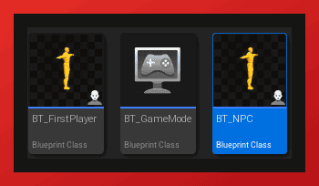
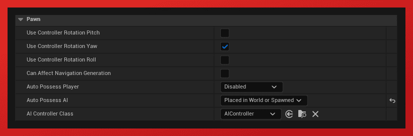
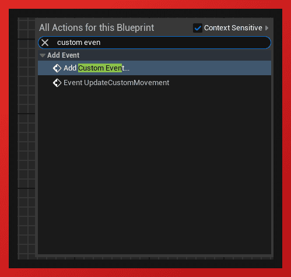
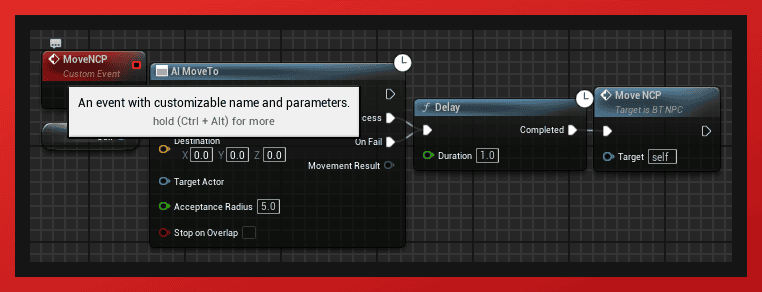
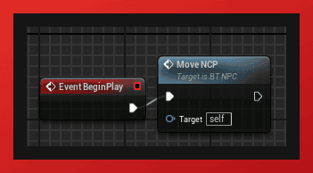
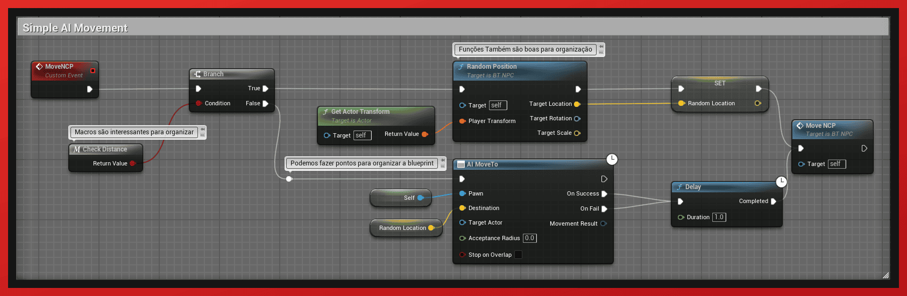
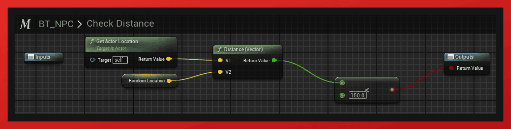
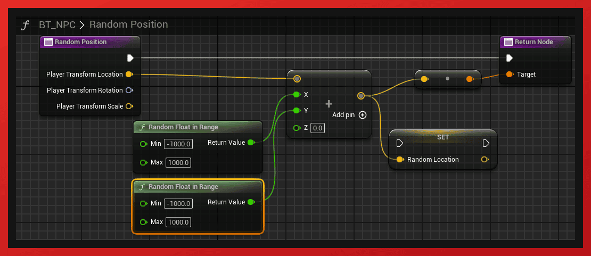

# Criando uma IA Simples na Unreal Engine

Neste tutorial, vamos criar uma IA básica para um personagem no Unreal Engine, reutilizando um personagem existente que você já criou. Vamos configurar o personagem para seguir comandos de movimentação de forma autônoma.

## Passo 1: Duplicar o Personagem

- Abra o Content Browser no Unreal Engine.
- Encontre o personagem que você deseja duplicar.
- Clique com o botão direito sobre ele e selecione "Duplicate".
- Renomeie o novo personagem para algo como NPC_SimpleAI.

## Passo 2: Configurar o Personagem como um Pawn

- Selecione o novo personagem duplicado.
- Na aba "Details", localize a sessão "Pawn".
- Altere a opção "Auto Possess Player" para "Disabled" e "Auto Possess AI" para "Placed in World or Spawned". Isso fará com que a IA assuma o controle do personagem em vez do jogador.

## Passo 3: Modificar a Blueprint do Personagem

- Abra a blueprint do personagem duplicado (NPC_SimpleAI).
- Remova todos os eventos que respondem ao input do jogador, como "Input Axis" ou "Input Action". Como esse personagem será controlado por IA, não precisamos de inputs manuais.
- Agora, crie um novo evento para controlar o movimento do NPC.

## Passo 4: Comandar o NPC a Mover-se

- Dentro do evento criado, use o nó "AI Move To". Este nó permitirá que o NPC se mova para um ponto específico no mapa.
- Configure os parâmetros do nó, como o destino da movimentação.
- 
- 

## Comando de Movimentação

- Certifique-se de disparar o evento em algum momento, seja na inicialização ou em resposta a um evento do jogo.

## Passo 5: Expandir com Funções e Macros

- Para tornar a IA um pouco mais sofisticada, você pode usar funções e macros dentro da blueprint.

- Uma macro permite agrupar blocos de nós que você pode reutilizar em diferentes partes do script, facilitando a organização e a leitura do código.

- As funções podem ser usadas para criar comportamentos específicos que podem ser chamados a partir de diferentes eventos na blueprint.

Esta foi uma implementação básica de IA em um personagem no Unreal Engine. Embora essa IA seja simples, você já tem uma base sólida para construir comportamentos mais complexos. Para isso, você pode explorar outras ferramentas como o Behavior Tree, que é uma poderosa ferramenta integrada no Unreal Engine para criar IAs avançadas.

